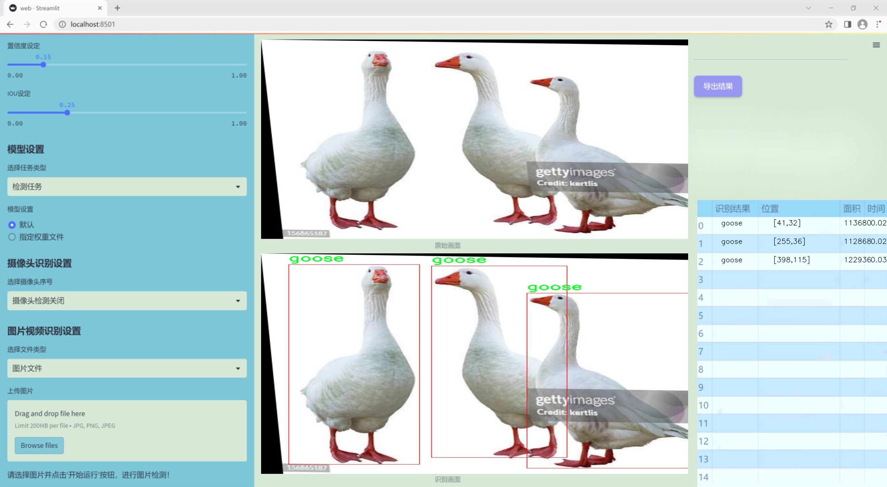
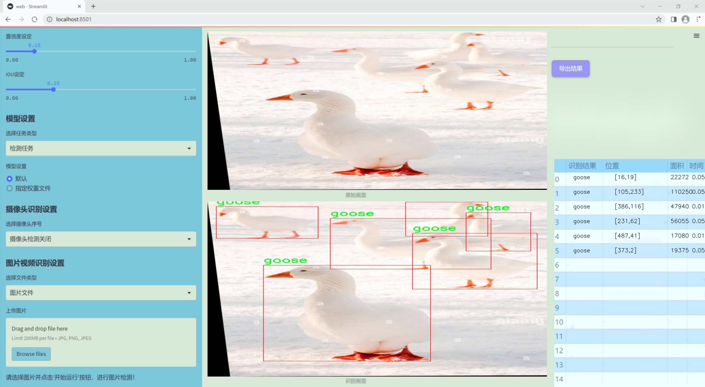
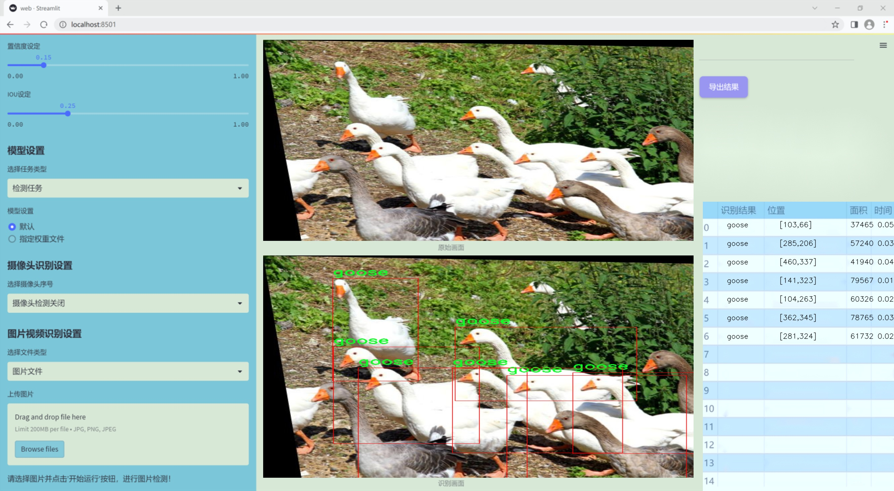
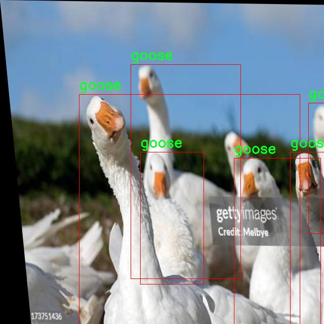
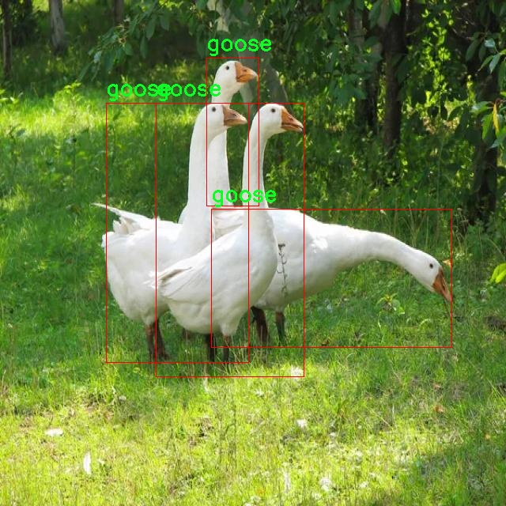
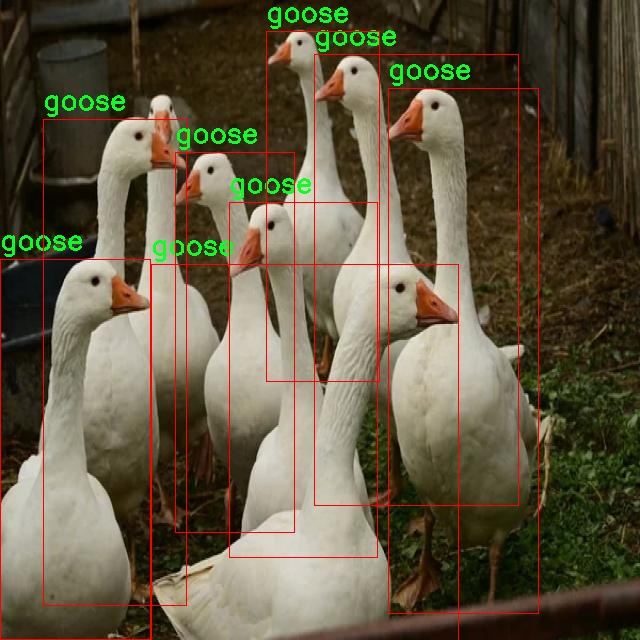
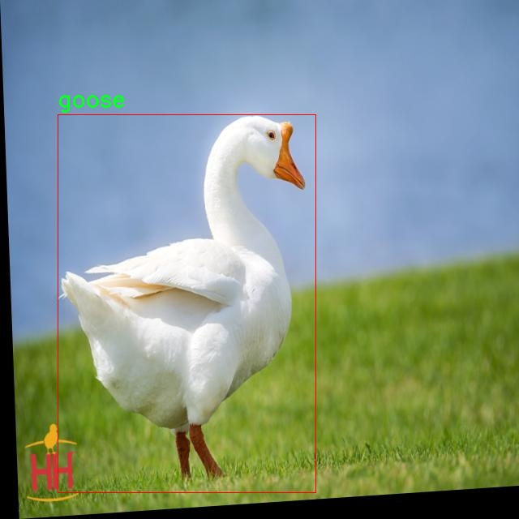
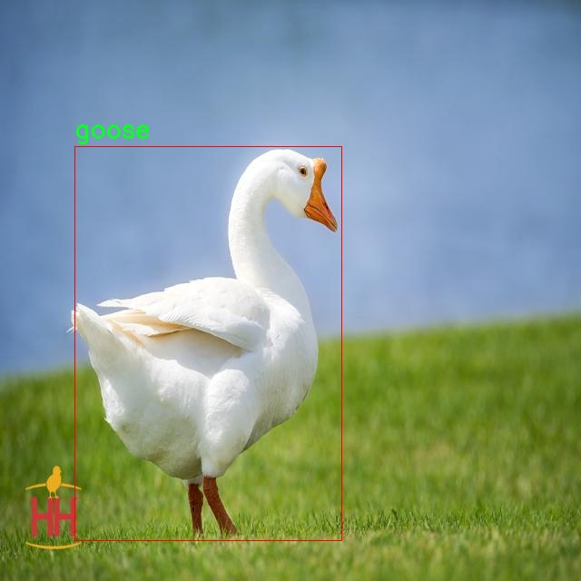

### 1.背景意义

研究背景与意义

随着生态保护意识的增强和生物多样性研究的深入，野生动物的监测与保护逐渐成为全球范围内的重要议题。鹅类作为水鸟的一种，因其在生态系统中的重要角色以及对环境变化的敏感性，成为了生物监测研究的重点对象。鹅类的数量和分布变化不仅反映了生态环境的健康状况，也为研究气候变化及人类活动对生态系统的影响提供了重要数据。因此，开发高效的鹅类检测系统，对于生态保护、科学研究及政策制定具有重要的现实意义。

在计算机视觉技术迅速发展的背景下，基于深度学习的目标检测算法逐渐成为动物监测的重要工具。YOLO（You Only Look Once）系列算法因其高效性和实时性，广泛应用于各类目标检测任务。YOLOv11作为该系列的最新版本，具备更强的特征提取能力和更高的检测精度，为鹅类的自动检测提供了良好的技术基础。然而，现有的YOLOv11模型在特定物种的检测上仍存在一定的局限性，尤其是在样本数量较少或特征相似度较高的情况下，检测效果可能不尽如人意。因此，针对鹅类的特征进行改进和优化，构建一个专门的鹅类检测系统，显得尤为必要。

本研究将基于改进的YOLOv11模型，利用一个包含523张鹅类图像的数据集进行训练和测试。该数据集经过精心标注和预处理，包含了丰富的图像增强技术，以提高模型的泛化能力和鲁棒性。通过对鹅类的高效检测，不仅能够为生态监测提供实时数据支持，还能够为后续的生态研究和保护措施提供科学依据。总之，基于改进YOLOv11的鹅类检测系统的研究，不仅具有重要的学术价值，也为实际的生态保护工作提供了有力的技术支持。

### 2.视频效果

[2.1 视频效果](https://www.bilibili.com/video/BV1iHBvYFEjE/)

### 3.图片效果







##### [项目涉及的源码数据来源链接](https://kdocs.cn/l/cszuIiCKVNis)**

注意：本项目提供训练的数据集和训练教程,由于版本持续更新,暂不提供权重文件（best.pt）,请按照6.训练教程进行训练后实现上图演示的效果。

### 4.数据集信息

##### 4.1 本项目数据集类别数＆类别名

nc: 1
names: ['goose']


该项目为【目标检测】数据集，请在【训练教程和Web端加载模型教程（第三步）】这一步的时候按照【目标检测】部分的教程来训练

##### 4.2 本项目数据集信息介绍

本项目数据集信息介绍

本项目旨在改进YOLOv11的鹅类检测系统，因此所使用的数据集专注于“goose shape”这一主题。该数据集的设计旨在提供高质量的图像，以便于训练深度学习模型在不同环境和条件下准确识别和检测鹅的形态特征。数据集中包含的类别数量为1，具体类别为“goose”，这意味着所有的训练样本均围绕这一特定类别展开，确保模型能够深入学习和提取与鹅相关的独特特征。

为了实现这一目标，数据集中的图像涵盖了多种场景和背景，包括自然栖息地、城市环境以及人工饲养场所等。这种多样性使得模型在实际应用中能够更好地适应不同的环境变化，提高其鲁棒性和准确性。此外，数据集中包含的图像经过精心挑选和标注，确保每一张图像都能为模型提供清晰的目标信息。标注过程严格遵循标准化流程，以确保数据的准确性和一致性，从而为后续的模型训练奠定坚实的基础。

在数据集的构建过程中，我们还考虑到了不同的光照条件、视角和鹅的姿态变化，以增强模型的泛化能力。这种全面的考虑使得数据集不仅适用于基础的鹅类检测任务，还能为更复杂的应用场景提供支持，如生态监测、野生动物保护和农业管理等领域。通过利用这一数据集，改进后的YOLOv11模型将能够在实际应用中实现更高的检测精度和效率，为鹅类的研究和保护提供重要的技术支持。











### 5.全套项目环境部署视频教程（零基础手把手教学）

[5.1 所需软件PyCharm和Anaconda安装教程（第一步）](https://www.bilibili.com/video/BV1BoC1YCEKi/?spm_id_from=333.999.0.0&vd_source=bc9aec86d164b67a7004b996143742dc)


[5.2 安装Python虚拟环境创建和依赖库安装视频教程（第二步）](https://www.bilibili.com/video/BV1ZoC1YCEBw?spm_id_from=333.788.videopod.sections&vd_source=bc9aec86d164b67a7004b996143742dc)

### 6.改进YOLOv11训练教程和Web_UI前端加载模型教程（零基础手把手教学）

[6.1 改进YOLOv11训练教程和Web_UI前端加载模型教程（第三步）](https://www.bilibili.com/video/BV1BoC1YCEhR?spm_id_from=333.788.videopod.sections&vd_source=bc9aec86d164b67a7004b996143742dc)


按照上面的训练视频教程链接加载项目提供的数据集，运行train.py即可开始训练



     Epoch   gpu_mem       box       obj       cls    labels  img_size
     1/200     20.8G   0.01576   0.01955  0.007536        22      1280: 100%|██████████| 849/849 [14:42<00:00,  1.04s/it]
               Class     Images     Labels          P          R     mAP@.5 mAP@.5:.95: 100%|██████████| 213/213 [01:14<00:00,  2.87it/s]
                 all       3395      17314      0.994      0.957      0.0957      0.0843

     Epoch   gpu_mem       box       obj       cls    labels  img_size
     2/200     20.8G   0.01578   0.01923  0.007006        22      1280: 100%|██████████| 849/849 [14:44<00:00,  1.04s/it]
               Class     Images     Labels          P          R     mAP@.5 mAP@.5:.95: 100%|██████████| 213/213 [01:12<00:00,  2.95it/s]
                 all       3395      17314      0.996      0.956      0.0957      0.0845

     Epoch   gpu_mem       box       obj       cls    labels  img_size
     3/200     20.8G   0.01561    0.0191  0.006895        27      1280: 100%|██████████| 849/849 [10:56<00:00,  1.29it/s]
               Class     Images     Labels          P          R     mAP@.5 mAP@.5:.95: 100%|███████   | 187/213 [00:52<00:00,  4.04it/s]
                 all       3395      17314      0.996      0.957      0.0957      0.0845


###### [项目数据集下载链接](https://kdocs.cn/l/cszuIiCKVNis)

### 7.原始YOLOv11算法讲解


##### YOLOv11三大损失函数

YOLOv11（You Only Look Once）是一种流行的目标检测算法，其损失函数设计用于同时优化分类和定位任务。YOLO的损失函数通常包括几个部分：
**分类损失、定位损失（边界框回归损失）和置信度损失** 。其中，

  1. box_loss（边界框回归损失）是用于优化预测边界框与真实边界框之间的差异的部分。

  2. cls_loss（分类损失）是用于优化模型对目标类别的预测准确性的部分。分类损失确保模型能够正确地识别出图像中的对象属于哪个类别。

  3. dfl_loss（Distribution Focal Loss）是YOLO系列中的一种损失函数，特别是在一些改进版本如YOLOv5和YOLOv7中被引入。它的主要目的是解决目标检测中的类别不平衡问题，并提高模型在处理小目标和困难样本时的性能。

##### 边界框回归损失详解

box_loss（边界框回归损失）是用于优化预测边界框与真实边界框之间的差异的部分。


##### box_loss 的具体意义


##### 为什么需要 box_loss

  * 精确定位：通过最小化中心点坐标损失和宽高损失，模型能够更准确地预测目标的位置和大小。
  * 平衡不同类型的目标：使用平方根来处理宽高损失，可以更好地平衡不同大小的目标，确保小目标也能得到足够的关注。
  * 稳定训练：适当的损失函数设计有助于模型的稳定训练，避免梯度爆炸或消失等问题。

##### 分类损失详解

在YOLO（You Only Look
Once）目标检测算法中，cls_loss（分类损失）是用于优化模型对目标类别的预测准确性的部分。分类损失确保模型能够正确地识别出图像中的对象属于哪个类别。下面是关于cls_loss的详细解读：

##### 分类损失 (cls_loss) 的具体意义

  
分类损失通常使用交叉熵损失（Cross-Entropy
Loss）来计算。交叉熵损失衡量的是模型预测的概率分布与真实标签之间的差异。在YOLO中，分类损失的具体形式如下：


##### 为什么需要 cls_loss

  * 类别识别：cls_loss 确保模型能够正确识别出图像中的目标属于哪个类别。这对于目标检测任务至关重要，因为不仅需要知道目标的位置，还需要知道目标的类型。

  * 多类别支持：通过最小化分类损失，模型可以处理多个类别的目标检测任务。例如，在道路缺陷检测中，可能需要识别裂缝、坑洞、路面破损等多种类型的缺陷。

  * 提高准确性：分类损失有助于提高模型的分类准确性，从而提升整体检测性能。通过优化分类损失，模型可以更好地学习不同类别之间的特征差异。

##### 分布损失详解

`dfl_loss`（Distribution Focal
Loss）是YOLO系列中的一种损失函数，特别是在一些改进版本如YOLOv5和YOLOv7中被引入。它的主要目的是解决目标检测中的类别不平衡问题，并提高模型在处理小目标和困难样本时的性能。下面是对`dfl_loss`的详细解读：

##### DFL Loss 的背景

在目标检测任务中，类别不平衡是一个常见的问题。某些类别的样本数量可能远远多于其他类别，这会导致模型在训练过程中对常见类别的学习效果较好，而对罕见类别的学习效果较差。此外，小目标和困难样本的检测也是一个挑战，因为这些目标通常具有较少的特征信息，容易被忽略或误分类。

为了应对这些问题，研究者们提出了多种改进方法，其中之一就是`dfl_loss`。`dfl_loss`通过引入分布焦点损失来增强模型对困难样本的关注，并改善类别不平衡问题。

##### DFL Loss 的定义

DFL Loss
通常与传统的交叉熵损失结合使用，以增强模型对困难样本的学习能力。其核心思想是通过对每个类别的预测概率进行加权，使得模型更加关注那些难以正确分类的样本。

DFL Loss 的公式可以表示为：


##### DFL Loss 的具体意义**

  * **类别不平衡：** 通过引入平衡因子 α，DFL Loss 可以更好地处理类别不平衡问题。对于少数类别的样本，可以通过增加其权重来提升其重要性，从而提高模型对这些类别的检测性能。
  *  **困难样本：** 通过聚焦参数 γ，DFL Loss 可以让模型更加关注那些难以正确分类的样本。当 
  * γ 较大时，模型会对那些预测概率较低的样本给予更多的关注，从而提高这些样本的分类准确性。
  *  **提高整体性能** ：DFL Loss 结合了传统交叉熵损失的优势，并通过加权机制增强了模型对困难样本的学习能力，从而提高了整体的检测性能。


### 8.200+种全套改进YOLOV11创新点原理讲解

#### 8.1 200+种全套改进YOLOV11创新点原理讲解大全

由于篇幅限制，每个创新点的具体原理讲解就不全部展开，具体见下列网址中的改进模块对应项目的技术原理博客网址【Blog】（创新点均为模块化搭建，原理适配YOLOv5~YOLOv11等各种版本）

[改进模块技术原理博客【Blog】网址链接](https://gitee.com/qunmasj/good)


#### 8.2 精选部分改进YOLOV11创新点原理讲解

###### 这里节选部分改进创新点展开原理讲解(完整的改进原理见上图和[改进模块技术原理博客链接](https://gitee.com/qunmasj/good)【如果此小节的图加载失败可以通过CSDN或者Github搜索该博客的标题访问原始博客，原始博客图片显示正常】


### HRNet V2简介
现在设计高低分辨率融合的思路主要有以下四种：


（a）对称结构。如U-Net、Hourglass等，都是先下采样再上采样，上下采样过程对称。

（b）级联金字塔。如refinenet等，高低分辨率融合时经过卷积处理。

（c）简单的baseline，用转职卷积进行上采样。

（d）扩张卷积。如deeplab等，增大感受野，减少下采样次数，可以无需跳层连接直接进行上采样。

（b）（c）都是使用复杂一些的网络进行下采样（如resnet、vgg），再用轻量级的网络进行上采样。

HRNet V1是在（b）的基础上进行改进，从头到尾保持大的分辨率表示。然而HRNet V1仅是用在姿态估计领域的，HRNet V2对它做小小的改进可以使其适用于更广的视觉任务。这一改进仅仅增加了较小的计算开销，但却提升了较大的准确度。

#### 网络结构图：


这个结构图简洁明了就不多介绍了，首先图2的输入是已经经过下采样四倍的feature map，横向的conv block指的是basicblock 或 bottleblock，不同分辨率之间的多交叉线部分是multi-resolution convolution（多分辨率组卷积）。

到此为止HRNet V2和HRNet V1是完全一致的。

区别之处在于这个基网络上加的一个head：


图3介绍的是接在图2最后的head。（a）是HRNet V1的头，很明显他只用了大分辨率的特征图。（b）（c）是HRNet V2的创新点，（b）用与语义分割，（c）用于目标检测。除此之外作者还在实验部分介绍了用于分类的head，如图4所示。


#### 多分辨率block：


一个多分辨率block由多分辨率组卷积（a）和多分辨率卷积（b）组成。（c）是一个正常卷积的展开，（b）的灵感来源于（c）。代码中（a）部分由Bottleneck和BasicBlock组成。

多分辨率卷积和正常卷积的区别：（1）多分辨率卷积中，每个通道的subset的分辨率都不一样。（2）通道之间的连接如果是降分辨率，则用的是3x3的2stride的卷积，如果是升分辨率，用的是双线性最邻近插值上采样。


### 9.系统功能展示

图9.1.系统支持检测结果表格显示

  图9.2.系统支持置信度和IOU阈值手动调节

  图9.3.系统支持自定义加载权重文件best.pt(需要你通过步骤5中训练获得)

  图9.4.系统支持摄像头实时识别

  图9.5.系统支持图片识别

  图9.6.系统支持视频识别

  图9.7.系统支持识别结果文件自动保存

  图9.8.系统支持Excel导出检测结果数据


### 10. YOLOv11核心改进源码讲解

#### 10.1 utils.py

以下是经过精简和注释的核心代码部分，主要保留了多尺度可变形注意力机制的实现，以及一些必要的工具函数。

```python
import copy
import math
import numpy as np
import torch
import torch.nn as nn
import torch.nn.functional as F
from torch.nn.init import uniform_

def multi_scale_deformable_attn_pytorch(
    value: torch.Tensor,
    value_spatial_shapes: torch.Tensor,
    sampling_locations: torch.Tensor,
    attention_weights: torch.Tensor,
) -> torch.Tensor:
    """
    多尺度可变形注意力机制。

    参数:
        value: 输入特征图，形状为 (bs, C, num_heads, embed_dims)
        value_spatial_shapes: 特征图的空间形状，形状为 (num_levels, 2)
        sampling_locations: 采样位置，形状为 (bs, num_queries, num_heads, num_levels, num_points, 2)
        attention_weights: 注意力权重，形状为 (bs, num_heads, num_queries, num_levels, num_points)

    返回:
        output: 经过注意力机制处理后的输出，形状为 (bs, num_queries, num_heads * embed_dims)
    """
    bs, _, num_heads, embed_dims = value.shape  # 获取输入的批次大小、通道数、头数和嵌入维度
    _, num_queries, _, num_levels, num_points, _ = sampling_locations.shape  # 获取查询数量、层数和每层的点数

    # 将输入特征图按空间形状分割成多个部分
    value_list = value.split([H_ * W_ for H_, W_ in value_spatial_shapes], dim=1)
    # 将采样位置映射到[-1, 1]区间
    sampling_grids = 2 * sampling_locations - 1
    sampling_value_list = []

    for level, (H_, W_) in enumerate(value_spatial_shapes):
        # 处理每一层的特征图
        value_l_ = value_list[level].flatten(2).transpose(1, 2).reshape(bs * num_heads, embed_dims, H_, W_)
        # 处理每一层的采样位置
        sampling_grid_l_ = sampling_grids[:, :, :, level].transpose(1, 2).flatten(0, 1)
        # 使用双线性插值从特征图中采样
        sampling_value_l_ = F.grid_sample(
            value_l_, sampling_grid_l_, mode="bilinear", padding_mode="zeros", align_corners=False
        )
        sampling_value_list.append(sampling_value_l_)

    # 处理注意力权重
    attention_weights = attention_weights.transpose(1, 2).reshape(
        bs * num_heads, 1, num_queries, num_levels * num_points
    )
    
    # 计算最终输出
    output = (
        (torch.stack(sampling_value_list, dim=-2).flatten(-2) * attention_weights)
        .sum(-1)
        .view(bs, num_heads * embed_dims, num_queries)
    )
    
    return output.transpose(1, 2).contiguous()  # 返回形状为 (bs, num_queries, num_heads * embed_dims) 的输出
```

### 代码说明：
1. **多尺度可变形注意力机制**：该函数实现了多尺度可变形注意力机制，通过对输入特征图进行空间分割和采样，结合注意力权重生成最终的输出特征。
2. **输入参数**：
   - `value`：输入特征图，包含多个头和嵌入维度。
   - `value_spatial_shapes`：特征图的空间形状，提供每个特征图的高度和宽度。
   - `sampling_locations`：指定从特征图中采样的位置。
   - `attention_weights`：每个查询的注意力权重，用于加权不同的采样值。
3. **输出**：经过注意力机制处理后的输出特征，形状为 `(bs, num_queries, num_heads * embed_dims)`。

这个 `utils.py` 文件是一个用于实现多种工具函数的模块，主要用于深度学习模型的构建和初始化，特别是在与 YOLO（You Only Look Once）相关的任务中。文件中包含了一些常用的函数，涉及到模块的克隆、权重初始化、反sigmoid函数的计算以及多尺度可变形注意力机制的实现。

首先，文件导入了一些必要的库，包括 `copy`、`math`、`numpy` 和 `torch`，其中 `torch` 是 PyTorch 的核心库，提供了深度学习所需的张量操作和神经网络模块。

接下来，定义了一个 `_get_clones` 函数，该函数用于创建给定模块的多个克隆副本，返回一个 `nn.ModuleList`，这是 PyTorch 中用于存储多个子模块的容器。这在构建复杂的神经网络时非常有用，尤其是当需要多个相同结构的层时。

`bias_init_with_prob` 函数用于根据给定的先验概率初始化卷积或全连接层的偏置值。通过计算负对数几率，确保偏置的初始化能够反映出特定的概率分布。

`linear_init` 函数则用于初始化线性模块的权重和偏置。它使用均匀分布在一个特定的范围内初始化权重，并且如果模块有偏置，则同样进行初始化。这个初始化方法有助于加速模型的收敛。

`inverse_sigmoid` 函数计算输入张量的反sigmoid值。该函数首先将输入限制在0到1之间，然后计算反sigmoid值，避免了数值不稳定的问题。

最后，`multi_scale_deformable_attn_pytorch` 函数实现了多尺度可变形注意力机制。该函数接收多个输入，包括值张量、空间形状、采样位置和注意力权重。它通过对输入进行处理，计算出不同尺度下的注意力值。函数内部使用了 `F.grid_sample` 来进行双线性插值，从而实现对采样位置的特征提取。最终，输出的结果是经过注意力加权的特征表示，适合后续的处理或分类任务。

总体来说，这个文件提供了一些深度学习模型构建中常用的工具函数，特别是在实现复杂的注意力机制时非常重要。

#### 10.2 fasternet.py

以下是代码中最核心的部分，并附上详细的中文注释：

```python
import torch
import torch.nn as nn
from typing import List
from torch import Tensor

class Partial_conv3(nn.Module):
    """部分卷积层，用于处理输入的特征图"""
    
    def __init__(self, dim, n_div, forward):
        super().__init__()
        self.dim_conv3 = dim // n_div  # 卷积通道数
        self.dim_untouched = dim - self.dim_conv3  # 未改变的通道数
        self.partial_conv3 = nn.Conv2d(self.dim_conv3, self.dim_conv3, 3, 1, 1, bias=False)  # 定义卷积层

        # 根据前向传播方式选择相应的函数
        if forward == 'slicing':
            self.forward = self.forward_slicing
        elif forward == 'split_cat':
            self.forward = self.forward_split_cat
        else:
            raise NotImplementedError

    def forward_slicing(self, x: Tensor) -> Tensor:
        """仅用于推理阶段的前向传播"""
        x = x.clone()  # 保持原始输入不变，以便后续的残差连接
        x[:, :self.dim_conv3, :, :] = self.partial_conv3(x[:, :self.dim_conv3, :, :])  # 处理前一部分通道
        return x

    def forward_split_cat(self, x: Tensor) -> Tensor:
        """用于训练和推理阶段的前向传播"""
        x1, x2 = torch.split(x, [self.dim_conv3, self.dim_untouched], dim=1)  # 将输入分为两部分
        x1 = self.partial_conv3(x1)  # 对第一部分进行卷积操作
        x = torch.cat((x1, x2), 1)  # 将两部分拼接
        return x


class MLPBlock(nn.Module):
    """多层感知机模块，包含卷积、归一化和激活函数"""
    
    def __init__(self, dim, n_div, mlp_ratio, drop_path, layer_scale_init_value, act_layer, norm_layer, pconv_fw_type):
        super().__init__()
        self.dim = dim
        self.mlp_ratio = mlp_ratio
        self.drop_path = nn.Identity() if drop_path <= 0 else DropPath(drop_path)  # 根据drop_path的值选择
        self.n_div = n_div

        mlp_hidden_dim = int(dim * mlp_ratio)  # 计算隐藏层维度

        # 定义MLP层
        mlp_layer: List[nn.Module] = [
            nn.Conv2d(dim, mlp_hidden_dim, 1, bias=False),
            norm_layer(mlp_hidden_dim),
            act_layer(),
            nn.Conv2d(mlp_hidden_dim, dim, 1, bias=False)
        ]
        self.mlp = nn.Sequential(*mlp_layer)  # 将MLP层组合成序列

        # 定义空间混合层
        self.spatial_mixing = Partial_conv3(dim, n_div, pconv_fw_type)

    def forward(self, x: Tensor) -> Tensor:
        """前向传播"""
        shortcut = x  # 保存输入以便进行残差连接
        x = self.spatial_mixing(x)  # 进行空间混合
        x = shortcut + self.drop_path(self.mlp(x))  # 残差连接
        return x


class FasterNet(nn.Module):
    """FasterNet主网络结构"""
    
    def __init__(self, in_chans=3, num_classes=1000, embed_dim=96, depths=(1, 2, 8, 2), mlp_ratio=2., n_div=4,
                 patch_size=4, patch_stride=4, patch_size2=2, patch_stride2=2, patch_norm=True, drop_path_rate=0.1,
                 layer_scale_init_value=0, norm_layer='BN', act_layer='RELU', pconv_fw_type='split_cat'):
        super().__init__()

        # 选择归一化层和激活函数
        norm_layer = nn.BatchNorm2d if norm_layer == 'BN' else NotImplementedError
        act_layer = partial(nn.ReLU, inplace=True) if act_layer == 'RELU' else NotImplementedError

        self.num_stages = len(depths)  # 网络阶段数
        self.embed_dim = embed_dim  # 嵌入维度
        self.depths = depths  # 每个阶段的深度

        # 分块嵌入
        self.patch_embed = PatchEmbed(patch_size=patch_size, patch_stride=patch_stride, in_chans=in_chans,
                                      embed_dim=embed_dim, norm_layer=norm_layer if patch_norm else None)

        # 构建网络的各个阶段
        stages_list = []
        for i_stage in range(self.num_stages):
            stage = BasicStage(dim=int(embed_dim * 2 ** i_stage), n_div=n_div, depth=depths[i_stage],
                               mlp_ratio=mlp_ratio, drop_path=drop_path_rate, layer_scale_init_value=layer_scale_init_value,
                               norm_layer=norm_layer, act_layer=act_layer, pconv_fw_type=pconv_fw_type)
            stages_list.append(stage)

            # 添加补丁合并层
            if i_stage < self.num_stages - 1:
                stages_list.append(PatchMerging(patch_size2=patch_size2, patch_stride2=patch_stride2,
                                                 dim=int(embed_dim * 2 ** i_stage), norm_layer=norm_layer))

        self.stages = nn.Sequential(*stages_list)  # 将所有阶段组合成序列

    def forward(self, x: Tensor) -> Tensor:
        """前向传播，输出四个阶段的特征"""
        x = self.patch_embed(x)  # 进行嵌入
        outs = []
        for idx, stage in enumerate(self.stages):
            x = stage(x)  # 通过每个阶段
            if idx in [0, 2, 4, 6]:  # 选择输出的阶段
                outs.append(x)  # 保存输出
        return outs  # 返回所有阶段的输出
```

### 代码说明：
1. **Partial_conv3**：定义了一个部分卷积层，可以根据不同的前向传播方式进行操作，适用于推理和训练阶段。
2. **MLPBlock**：实现了一个多层感知机模块，包含卷积、归一化和激活函数，并通过残差连接来增强特征传递。
3. **FasterNet**：主网络结构，包含多个阶段，每个阶段由多个MLPBlock组成，并在适当的位置进行特征合并。

这个简化的代码保留了核心的网络结构和前向传播逻辑，注释详细说明了每个部分的功能和作用。

这个程序文件 `fasternet.py` 实现了一个名为 FasterNet 的深度学习模型，主要用于图像处理任务。该模型由多个模块组成，包括卷积层、MLP（多层感知机）块、嵌入层和合并层等。以下是对代码的详细说明。

首先，程序导入了必要的库，包括 PyTorch、YAML 和一些神经网络模块。接着，定义了多个类，每个类代表模型的不同组成部分。

`Partial_conv3` 类实现了一个部分卷积层，可以选择不同的前向传播方式（切片或拼接）。在前向传播中，`forward_slicing` 方法仅用于推理阶段，而 `forward_split_cat` 方法则用于训练和推理阶段。它们的主要功能是对输入张量进行卷积操作，同时保留原始输入以便后续的残差连接。

`MLPBlock` 类定义了一个多层感知机块，包含了卷积层、归一化层和激活函数。它还实现了带有可选层缩放的前向传播方法。`BasicStage` 类则由多个 `MLPBlock` 组成，形成一个基本的阶段结构。

`PatchEmbed` 类用于将输入图像分割成不重叠的补丁，并通过卷积层进行嵌入。`PatchMerging` 类则用于合并补丁，减少特征图的维度。

`FasterNet` 类是整个模型的核心，初始化时接受多个参数，包括输入通道数、类别数、嵌入维度、深度、MLP 比例等。模型的构建包括多个阶段，每个阶段由 `BasicStage` 组成，并在某些阶段后添加 `PatchMerging` 层。模型的前向传播方法会输出四个阶段的特征图，便于进行密集预测。

此外，程序还定义了一个 `update_weight` 函数，用于更新模型的权重。它会检查权重字典中的每个键，确保与模型的权重形状匹配，并将其更新到模型中。

最后，程序提供了多个函数（如 `fasternet_t0`、`fasternet_t1` 等），用于加载不同配置的 FasterNet 模型。这些函数会读取 YAML 配置文件，初始化模型，并在提供权重文件时加载预训练权重。

在主程序部分，代码示例展示了如何加载一个 FasterNet 模型，并生成随机输入以测试模型的输出尺寸。

整体来看，这个程序实现了一个灵活且可扩展的深度学习模型，适用于各种图像处理任务，特别是在需要高效特征提取的场景中。

#### 10.3 pkinet.py

以下是代码中最核心的部分，并附上详细的中文注释：

```python
import math
import torch
import torch.nn as nn
from typing import Optional, Sequence

class DropPath(nn.Module):
    """实现随机深度（Drop Path）模块，用于在残差块的主路径中随机丢弃路径。"""
    
    def __init__(self, drop_prob: float = 0.1):
        super().__init__()
        self.drop_prob = drop_prob  # 丢弃路径的概率

    def forward(self, x: torch.Tensor) -> torch.Tensor:
        """前向传播函数，应用随机丢弃路径。"""
        if self.drop_prob == 0. or not self.training:
            return x  # 如果丢弃概率为0或不在训练模式，直接返回输入
        keep_prob = 1 - self.drop_prob
        shape = (x.shape[0], ) + (1, ) * (x.ndim - 1)  # 处理不同维度的张量
        random_tensor = keep_prob + torch.rand(shape, dtype=x.dtype, device=x.device)  # 生成随机张量
        output = x.div(keep_prob) * random_tensor.floor()  # 应用丢弃
        return output

class ConvFFN(BaseModule):
    """使用卷积模块实现的多层感知机（Feed Forward Network）。"""
    
    def __init__(self, in_channels: int, out_channels: Optional[int] = None, hidden_channels_scale: float = 4.0):
        super().__init__()
        out_channels = out_channels or in_channels  # 如果未指定输出通道，则与输入通道相同
        hidden_channels = int(in_channels * hidden_channels_scale)  # 计算隐藏通道数

        # 定义前馈网络的层
        self.ffn_layers = nn.Sequential(
            nn.LayerNorm(in_channels),  # 归一化层
            ConvModule(in_channels, hidden_channels, kernel_size=1),  # 1x1卷积
            ConvModule(hidden_channels, hidden_channels, kernel_size=3, padding=1, groups=hidden_channels),  # 深度卷积
            nn.GELU(),  # 激活函数
            nn.Dropout(0.1),  # Dropout层
            ConvModule(hidden_channels, out_channels, kernel_size=1),  # 1x1卷积到输出通道
        )

    def forward(self, x):
        """前向传播函数，应用前馈网络。"""
        return self.ffn_layers(x)

class PKIBlock(BaseModule):
    """多核Inception块，结合了多个卷积层和前馈网络。"""
    
    def __init__(self, in_channels: int, out_channels: Optional[int] = None):
        super().__init__()
        out_channels = out_channels or in_channels
        self.block = InceptionBottleneck(in_channels, out_channels)  # Inception瓶颈
        self.ffn = ConvFFN(out_channels)  # 前馈网络
        self.drop_path = DropPath(0.1)  # 随机丢弃路径

    def forward(self, x):
        """前向传播函数，执行Inception块和前馈网络。"""
        x = self.block(x)  # 通过Inception块
        x = self.drop_path(x)  # 应用随机丢弃路径
        x = self.ffn(x)  # 通过前馈网络
        return x

class PKINet(BaseModule):
    """多核Inception网络，包含多个PKIBlock。"""
    
    def __init__(self, arch: str = 'S'):
        super().__init__()
        self.stages = nn.ModuleList()  # 定义网络的各个阶段
        self.stages.append(Stem(3, 32))  # 添加Stem层
        # 添加多个PKIBlock
        for _ in range(4):
            self.stages.append(PKIBlock(32, 64))

    def forward(self, x):
        """前向传播函数，依次通过各个阶段。"""
        for stage in self.stages:
            x = stage(x)
        return x

def PKINET_T():
    """构建并返回一个小型的多核Inception网络。"""
    return PKINet('T')

if __name__ == '__main__':
    model = PKINET_T()  # 创建模型实例
    inputs = torch.randn((1, 3, 640, 640))  # 创建输入张量
    res = model(inputs)  # 前向传播
    print(res.size())  # 输出结果的尺寸
```

### 代码说明：
1. **DropPath**: 实现了随机深度的功能，通过在训练过程中随机丢弃某些路径来增强模型的泛化能力。
2. **ConvFFN**: 实现了一个前馈网络，使用卷积层代替全连接层，适合处理图像数据。
3. **PKIBlock**: 组合了Inception瓶颈和前馈网络的功能，形成一个完整的块。
4. **PKINet**: 组合多个PKIBlock，形成一个完整的多核Inception网络。
5. **PKINET_T**: 用于构建一个特定架构的多核Inception网络实例。

这段代码展示了如何使用PyTorch构建一个深度学习模型，利用模块化的设计使得网络结构清晰且易于扩展。

这个程序文件 `pkinet.py` 实现了一个名为 PKINet 的深度学习模型，主要用于计算机视觉任务。它使用了 PyTorch 框架，并结合了一些自定义的模块和层。以下是对代码的详细讲解。

首先，程序导入了一些必要的库，包括数学库、类型提示、PyTorch 及其神经网络模块。它还尝试导入一些来自 `mmcv` 和 `mmengine` 的模块，以便于构建卷积模块和模型的基础功能。如果这些库未能导入，则使用 PyTorch 的基本模块作为替代。

接下来，定义了一些辅助函数和类。`drop_path` 函数实现了随机深度（Stochastic Depth）的功能，用于在训练过程中随机丢弃路径。`DropPath` 类则是对该功能的封装，继承自 `nn.Module`，并在前向传播中调用 `drop_path` 函数。

`autopad` 函数用于自动计算卷积操作的填充，以确保输出的尺寸符合要求。`make_divisible` 函数确保通道数是某个值的倍数，这在模型设计中非常重要，以便于优化和兼容性。

`BCHW2BHWC` 和 `BHWC2BCHW` 类用于在不同的张量格式之间进行转换，这在处理图像数据时很常见。`GSiLU` 类实现了一种激活函数，结合了全局平均池化和 Sigmoid 函数。

`CAA` 类实现了上下文锚点注意力机制，使用多个卷积层和激活函数来计算注意力因子。`ConvFFN` 类则实现了一个多层感知机，使用卷积模块来替代传统的全连接层。

`Stem` 类定义了模型的初始层，用于处理输入数据并提取特征。`DownSamplingLayer` 类则用于下采样操作，减少特征图的尺寸。

`InceptionBottleneck` 类实现了一个瓶颈结构，结合了多个卷积操作和可选的上下文锚点注意力机制。`PKIBlock` 类是多核 Inception 块的实现，结合了瓶颈结构和前馈网络。

`PKIStage` 类则是多个 `PKIBlock` 的组合，形成模型的一个阶段。最后，`PKINet` 类是整个网络的实现，定义了网络的架构和各个阶段的连接。

在 `PKINet` 的构造函数中，定义了不同的网络架构设置，并根据输入参数构建网络的各个阶段。模型的前向传播方法 `forward` 将输入数据传递通过各个阶段，并根据需要返回特定的输出。

最后，程序提供了三个函数 `PKINET_T`、`PKINET_S` 和 `PKINET_B`，用于创建不同配置的 PKINet 模型。主程序部分则创建了一个 PKINET_T 模型实例，并进行了一次前向传播，输出结果的尺寸。

总体而言，这个文件实现了一个复杂的深度学习模型，结合了多种先进的网络结构和技巧，适用于图像处理和计算机视觉任务。

#### 10.4 shiftwise_conv.py

以下是代码中最核心的部分，并附上详细的中文注释：

```python
import math
import torch
import torch.nn as nn
import torch.nn.functional as F

class Mask(nn.Module):
    def __init__(self, size):
        super().__init__()
        # 初始化一个可学习的参数weight，大小为size，值在-1到1之间均匀分布
        self.weight = torch.nn.Parameter(data=torch.Tensor(*size), requires_grad=True)
        self.weight.data.uniform_(-1, 1)

    def forward(self, x):
        # 使用sigmoid函数将weight转化为0到1之间的值
        w = torch.sigmoid(self.weight)
        # 将输入x与w相乘，得到mask后的输出
        masked_wt = w.mul(x)
        return masked_wt

class ReparamLargeKernelConv(nn.Module):
    def __init__(self, in_channels, out_channels, kernel_size, small_kernel=5, stride=1, groups=1, small_kernel_merged=False, Decom=True, bn=True):
        super(ReparamLargeKernelConv, self).__init__()
        self.kernel_size = kernel_size  # 大卷积核的大小
        self.small_kernel = small_kernel  # 小卷积核的大小
        self.Decom = Decom  # 是否进行分解
        padding = kernel_size // 2  # 计算padding，确保卷积后特征图大小不变

        # 如果小卷积核合并，则直接使用大卷积核
        if small_kernel_merged:
            self.lkb_reparam = nn.Conv2d(in_channels, out_channels, kernel_size, stride, padding, groups=groups, bias=True)
        else:
            # 如果需要分解，则使用LoRA卷积
            if self.Decom:
                self.LoRA = conv_bn(in_channels, out_channels, kernel_size=(kernel_size, small_kernel), stride=stride, padding=padding, groups=groups, bn=bn)
            else:
                # 否则使用原始的大卷积核
                self.lkb_origin = conv_bn(in_channels, out_channels, kernel_size, stride=stride, padding=padding, groups=groups, bn=bn)

            # 如果小卷积核小于大卷积核，则添加小卷积核
            if (small_kernel is not None) and small_kernel < kernel_size:
                self.small_conv = conv_bn(in_channels, out_channels, small_kernel, stride=stride, padding=small_kernel // 2, groups=groups, bn=bn)

        self.bn = nn.BatchNorm2d(out_channels)  # 批归一化层
        self.act = nn.SiLU()  # 激活函数

    def forward(self, inputs):
        # 前向传播
        if hasattr(self, "lkb_reparam"):
            out = self.lkb_reparam(inputs)  # 使用重参数化的大卷积
        elif self.Decom:
            out = self.LoRA(inputs)  # 使用分解的卷积
            if hasattr(self, "small_conv"):
                out += self.small_conv(inputs)  # 加上小卷积的输出
        else:
            out = self.lkb_origin(inputs)  # 使用原始的大卷积
            if hasattr(self, "small_conv"):
                out += self.small_conv(inputs)  # 加上小卷积的输出
        return self.act(self.bn(out))  # 返回经过激活和批归一化的输出

    def get_equivalent_kernel_bias(self):
        # 获取等效的卷积核和偏置
        eq_k, eq_b = fuse_bn(self.lkb_origin.conv, self.lkb_origin.bn)
        if hasattr(self, "small_conv"):
            small_k, small_b = fuse_bn(self.small_conv.conv, self.small_conv.bn)
            eq_b += small_b  # 加上小卷积的偏置
            eq_k += nn.functional.pad(small_k, [(self.kernel_size - self.small_kernel) // 2] * 4)  # 对小卷积核进行填充
        return eq_k, eq_b  # 返回等效的卷积核和偏置

    def switch_to_deploy(self):
        # 切换到部署模式
        if hasattr(self, 'lkb_origin'):
            eq_k, eq_b = self.get_equivalent_kernel_bias()  # 获取等效的卷积核和偏置
            self.lkb_reparam = nn.Conv2d(self.lkb_origin.conv.in_channels, self.lkb_origin.conv.out_channels, self.lkb_origin.conv.kernel_size, stride=self.lkb_origin.conv.stride, padding=self.lkb_origin.conv.padding, groups=self.lkb_origin.conv.groups, bias=True)
            self.lkb_reparam.weight.data = eq_k  # 设置卷积核
            self.lkb_reparam.bias.data = eq_b  # 设置偏置
            self.__delattr__("lkb_origin")  # 删除原始卷积
            if hasattr(self, "small_conv"):
                self.__delattr__("small_conv")  # 删除小卷积
```

### 代码说明
1. **Mask类**：用于生成一个可学习的mask，通过sigmoid函数将权重限制在0到1之间，并与输入进行逐元素相乘。
2. **ReparamLargeKernelConv类**：实现了一个大卷积核的重参数化卷积层，可以选择是否使用小卷积核，并支持分解（Decom）和合并（small_kernel_merged）。
3. **forward方法**：实现了前向传播逻辑，根据是否使用重参数化、大卷积或小卷积进行计算，并返回经过激活和批归一化的输出。
4. **get_equivalent_kernel_bias方法**：用于获取等效的卷积核和偏置，方便在部署时使用。
5. **switch_to_deploy方法**：在模型部署时，将原始卷积层替换为重参数化卷积层，以提高推理速度。

这个程序文件 `shiftwise_conv.py` 实现了一个用于深度学习的卷积层，主要用于处理大卷积核的情况。文件中定义了多个类和函数，主要包括卷积操作、批归一化、以及通过权重进行的低秩适配（LoRA）卷积等。

首先，文件中导入了必要的库，包括 `torch` 和 `torch.nn`，这些是 PyTorch 框架的核心组件。接着，定义了一个 `get_conv2d` 函数，用于创建一个标准的二维卷积层。这个函数根据输入的参数（如输入通道数、输出通道数、卷积核大小、步幅、填充、扩张、分组和偏置）返回一个 `nn.Conv2d` 对象。

`get_bn` 函数则用于创建一个批归一化层。接下来，定义了一个 `Mask` 类，它是一个自定义的 PyTorch 模块，包含一个可学习的权重参数，并在前向传播中通过 sigmoid 函数对权重进行激活，从而对输入进行加权。

`conv_bn_ori` 函数用于创建一个包含卷积层和可选的批归一化层的序列模块。这个函数的设计允许用户选择是否使用批归一化。

`LoRAConvsByWeight` 类实现了通过权重进行的低秩适配卷积。该类的构造函数接受多个参数，包括输入和输出通道数、卷积核大小、步幅等。它内部定义了两个 `Mask` 对象用于处理不同的卷积输出，并在前向传播中将输出分为两个部分进行处理，最后将结果相加。

`forward_lora` 方法用于处理每个卷积输出，按组进行数据重排，并根据输入的高度和宽度进行适当的填充和裁剪。`rearrange_data` 方法则实现了数据的重排逻辑，确保在进行卷积操作时，能够正确处理不同的卷积核大小。

`shift` 方法用于计算填充和卷积窗口的索引，以确保卷积操作不会改变特征图的大小。

接下来，`conv_bn` 函数根据输入的卷积核大小调用相应的卷积和批归一化组合函数，支持单一卷积核和两个不同大小卷积核的情况。

`fuse_bn` 函数用于将卷积层和批归一化层融合为一个等效的卷积层，以提高推理速度。

最后，`ReparamLargeKernelConv` 类是整个文件的核心部分，它实现了一个可重参数化的大卷积核卷积层。构造函数中根据输入参数初始化卷积层和批归一化层，并在前向传播中计算输出。它还提供了获取等效卷积核和偏置的功能，以及切换到部署模式的方法，以便在推理时使用融合后的卷积层。

整体而言，这个文件实现了一个灵活且高效的卷积层，适用于需要处理大卷积核的深度学习模型，并通过低秩适配技术来提高模型的表达能力和计算效率。

### 11.完整训练+Web前端界面+200+种全套创新点源码、数据集获取


# [下载链接：https://mbd.pub/o/bread/Z5iZmZ9w](https://mbd.pub/o/bread/Z5iZmZ9w)